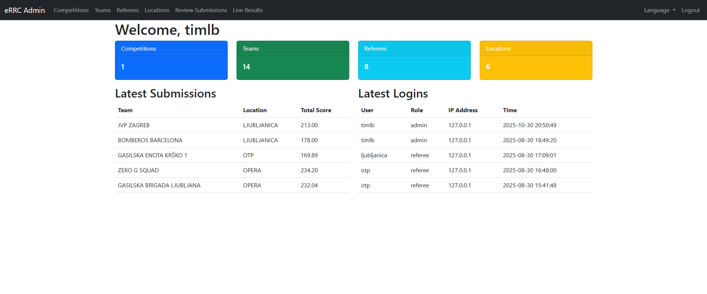
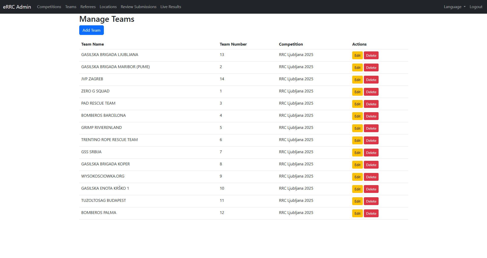
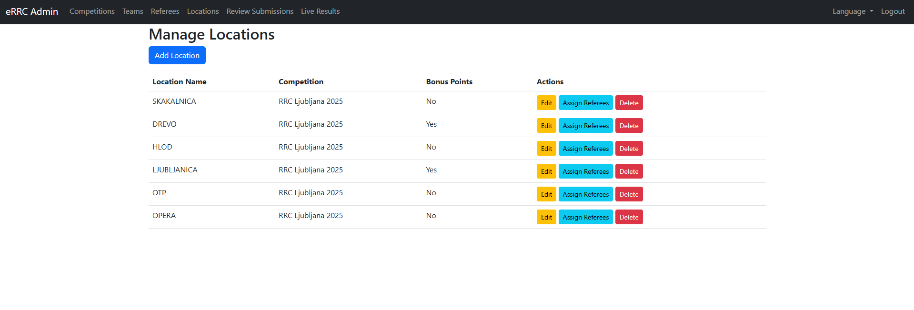
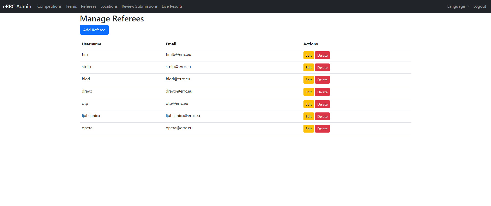
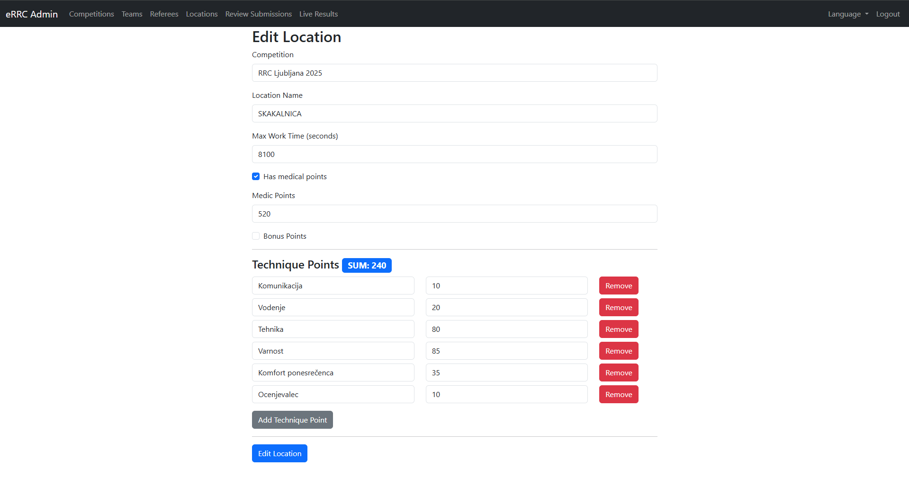
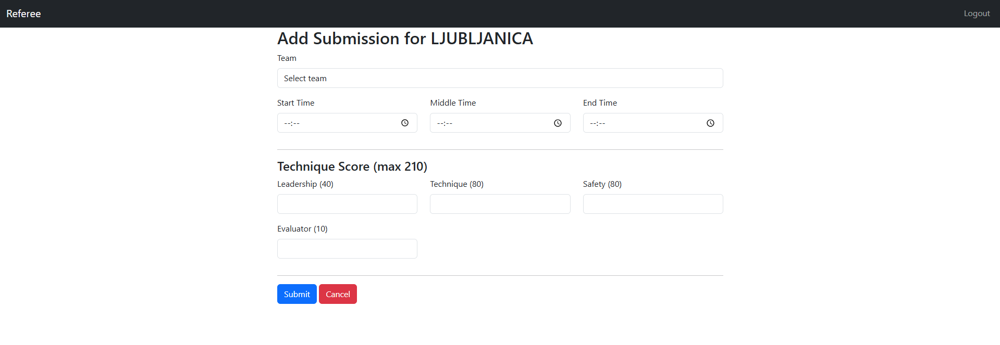
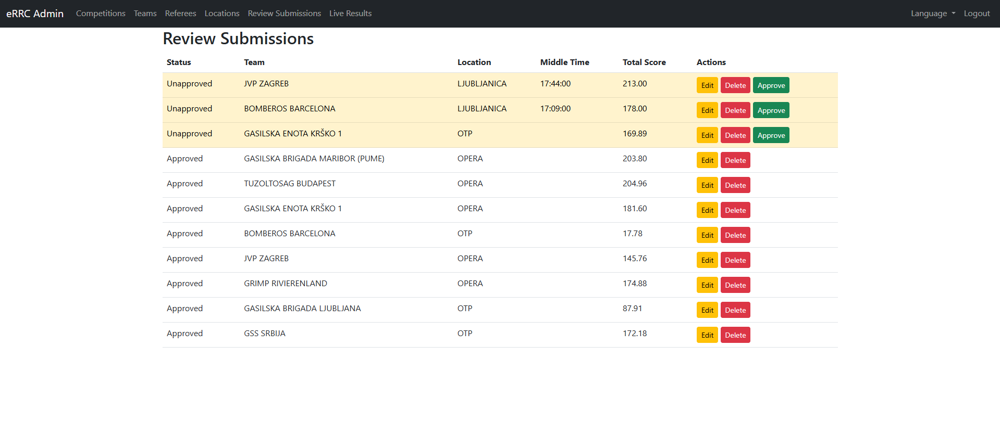
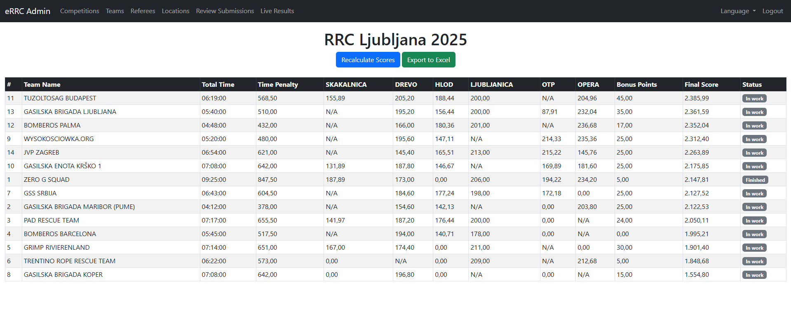

# 🧗‍♂️ eRRC – Rope Rescue Challenge Scoring System

**eRRC** is a web-based scoring and competition management system designed for **Rope Rescue Challenge** events.  
It allows referees, admins, and organizers to efficiently manage competitions, score teams, and display live results in real time.

---

## 🚀 Overview

The **eRRC** platform streamlines competition organization by providing role-based tools for referees, admins, and organizers:

- 🧑‍💼 **Admins** can create and manage competitions, locations, criteria, teams, and referees.
- 🧑‍⚖️ **Referees** can log in and input results for the locations they are assigned to.
- 🏆 **Organizers** can review, monitor, and export results in real time.

The system supports **English** and **Slovenian** languages.

---

## ✨ Features

- 🔐 **Role-based access** (Admin, Referee, Organizer)
- 🧩 **Competition management**
  - Create and edit competitions
  - Define multiple competition locations and scoring criteria
- 👥 **Team management**
  - Add, edit, and manage teams
- 📍 **Location management**
  - Manage scoring points and assign referees
- 🧑‍⚖️ **Referee management**
  - Create referee accounts and assign them to specific locations
- 📊 **Live results**
  - Real-time leaderboard updates
- 📥 **Result export**
  - Export to **PDF** or **Excel**
- 🌐 **Multilingual**
  - English 🇬🇧 and Slovenian 🇸🇮 interface support

---

## 🧭 Project Status

**eRRC** is currently in **beta testing**.  
The app has already been successfully used in **two Rope Rescue Challenge competitions**, with **excellent feedback** from both referees and organizers.

The primary goal is to make the system as **flexible and configurable** as possible — so that future competitions won’t require code or deployment changes.  
Instead, competition admins will be able to **fully configure competition criteria, locations, and scoring parameters** directly within the app.

In addition to the web app, an **Android app is currently in development**, allowing referees to **submit results offline** and later sync them with the main server, ensuring smooth operation even in areas with limited connectivity.

Please note that the **source code is not publicly available** at this time.  
This repository serves as a **presentation and showcase** of the project.

---

## 🖼️ Screenshots

| Feature | Preview |
|----------|----------|
| 🏠 Admin Dashboard |  |
| 👥 Team Management |  |
| 📍 Locations Management |  |
| 🧑‍⚖️ Referee Management |  |
| ✏️ Edit Location Page |  |
| 📝 Referee Submission Page |  |
| 🗂️ Submitted Submissions Page |  |
| 📊 Live Results Page |  |

---

## 📬 Contact

For more information, collaboration, or demo access, feel free to contact me.

---

> _“Built to make Rope Rescue Competitions scoring fair, fast, and transparent.”_
